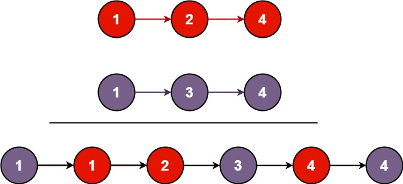

# LinkedList

`LinkedList<T>()` 
in C# cant manage nodes!

 - [ ] https://leetcode.com/explore/learn/card/linked-list/

## Reverse Linked List [169](https://leetcode.com/explore/interview/card/microsoft/32/linked-list/169/)

Given the head of a singly linked list, reverse the list, and return the reversed list.


```C#
/**
 * Definition for singly-linked list.
 * public class ListNode {
 *     public int val;
 *     public ListNode next;
 *     public ListNode(int val=0, ListNode next=null) {
 *         this.val = val;
 *         this.next = next;
 *     }
 * }
 */
public class Solution {
    public ListNode ReverseList(ListNode head) {
        ListNode prev = null;
        ListNode curr = head;
        while(curr != null)
        {
           ListNode nextTemp = curr.next;
           curr.next = prev;
           prev = curr;
           curr = nextTemp;
        }
        return prev;
    }
}
```

> Time O(N), Space O(1)


## Linked List Cycle [184](https://leetcode.com/explore/interview/card/microsoft/32/linked-list/184/)

Given head, the head of a linked list, determine if the linked list has a cycle in it.

There is a cycle in a linked list if there is some node in the list that can be reached again by continuously following the next pointer. Internally, pos is used to denote the index of the node that tail's next pointer is connected to. Note that pos is not passed as a parameter.

Return true if there is a cycle in the linked list. Otherwise, return false.

```C#
public class Solution {
    public bool HasCycle(ListNode head) {
        if(head==null) return false;
        List<ListNode> list = new List<ListNode>();
        ListNode node = head;
        while(node.next != null)
        {
            if(list.Contains(node))
            {
                return true;
            }
            list.Add(node);
            node = node.next;
        }
        return false;
    }
}
```

> O(N), O(N)

## Add Two Numbers [170](https://leetcode.com/explore/interview/card/microsoft/32/linked-list/170/)

```C#
/**
 * Definition for singly-linked list.
 * public class ListNode {
 *     public int val;
 *     public ListNode next;
 *     public ListNode(int val=0, ListNode next=null) {
 *         this.val = val;
 *         this.next = next;
 *     }
 * }
 */
public class Solution {
    public ListNode AddTwoNumbers(ListNode l1, ListNode l2) {
        ListNode dummyHead = new ListNode(0);
        ListNode curr = dummyHead;
        int carry = 0;
        while (l1 != null || l2 != null || carry != 0) {
            int x = (l1 != null) ? l1.val : 0;
            int y = (l2 != null) ? l2.val : 0;
            int sum = carry + x + y;
            carry = sum / 10;
            curr.next = new ListNode(sum % 10);
            curr = curr.next;
            if (l1 != null)
                l1 = l1.next;
            if (l2 != null)
                l2 = l2.next;
        }
        return dummyHead.next;
    }
}
```


## Add Two Numbers II [205](https://leetcode.com/explore/interview/card/microsoft/32/linked-list/205/)

You are given two non-empty linked lists representing two non-negative integers. The most significant digit comes first and each of their nodes contains a single digit. Add the two numbers and return the sum as a linked list.

You may assume the two numbers do not contain any leading zero, except the number 0 itself.

```C#
/**
 * Definition for singly-linked list.
 * public class ListNode {
 *     public int val;
 *     public ListNode next;
 *     public ListNode(int val=0, ListNode next=null) {
 *         this.val = val;
 *         this.next = next;
 *     }
 * }
 */
public class Solution {
    public ListNode ReverseList(ListNode head) {
        ListNode prev = null;
        ListNode curr = head;
        while(curr != null)
        {
           ListNode nextTemp = curr.next;
           curr.next = prev;
           prev = curr;
           curr = nextTemp;
        }
        return prev;
    }
    
    public ListNode AddTwoNumbers(ListNode l1, ListNode l2) {
        ListNode r1 = ReverseList(l1);
        ListNode r2 = ReverseList(l2);
        int totalSum = 0, carry = 0;
        ListNode ans = new ListNode();
        while(r1 != null || r2 != null)
        {
            if(r1 != null)
            {
                totalSum += r1.val;
                r1 = r1.next;
            }
            if(r2 != null)
            {
                totalSum += r2.val;
                r2 = r2.next;
            }
            ans.val = totalSum % 10;
            carry = totalSum / 10;
            ListNode head = new ListNode(carry);
            head.next = ans;
            ans = head;
            totalSum = carry;
        }
        return carry == 0 ? ans.next : ans;
    }
}
```

> O(M+N), O(M+N)

[Solution](https://leetcode.com/problems/add-two-numbers-ii/editorial/) Also can resolved over 2 stacks

## Merge Two Sorted Lists [175](https://leetcode.com/explore/interview/card/microsoft/32/linked-list/175/)

You are given the heads of two sorted linked lists list1 and list2.
Merge the two lists into one sorted list. The list should be made by splicing together the nodes of the first two lists.
Return the head of the merged linked list.

### Example 1:



```C#
/**
 * Definition for singly-linked list.
 * public class ListNode {
 *     public int val;
 *     public ListNode next;
 *     public ListNode(int val=0, ListNode next=null) {
 *         this.val = val;
 *         this.next = next;
 *     }
 * }
 */
public class Solution {
    public ListNode MergeTwoLists(ListNode list1, ListNode list2) {
        ListNode prehead = new ListNode(-1);
        ListNode result = prehead;

        while(list1 != null && list2 != null)
        {
            if(list1.val >= list2.val)
            {
                result.next = list2;
                list2 = list2.next;
            }
            else
            {
                result.next = list1;
                list1 =list1.next;
            }
            result = result.next;
        }
        
        if(list1==null)
        {
            result.next = list2;
        }
        else
        {
            result.next = list1;
        }

        return prehead.next;
    }
}
```

[Solution](https://leetcode.com/problems/merge-two-sorted-lists/editorial/) Also can using recursion


## Merge k Sorted Lists [209](https://leetcode.com/explore/interview/card/microsoft/32/linked-list/209/)

You are given an array of k linked-lists lists, each linked-list is sorted in ascending order.
Merge all the linked-lists into one sorted linked-list and return it.

### Example 1:

```
Input: lists = [[1,4,5],[1,3,4],[2,6]]
Output: [1,1,2,3,4,4,5,6]
Explanation: The linked-lists are:
[
  1->4->5,
  1->3->4,
  2->6
]
merging them into one sorted list:
1->1->2->3->4->4->5->6
```

### Example 2:

```
Input: lists = []
Output: []
```

### Example 3:

```
Input: lists = [[]]
Output: []
```

### Constraints:

```
k == lists.length
0 <= k <= 104
0 <= lists[i].length <= 500
-104 <= lists[i][j] <= 104
lists[i] is sorted in ascending order.
The sum of lists[i].length will not exceed 104.
```

```C#
/**
 * Definition for singly-linked list.
 * public class ListNode {
 *     public int val;
 *     public ListNode next;
 *     public ListNode(int val=0, ListNode next=null) {
 *         this.val = val;
 *         this.next = next;
 *     }
 * }
 */
public class Solution {
    public ListNode MergeKLists(ListNode[] lists) {
        ListNode prehead = new ListNode(-1);
        ListNode result = prehead;
        List<ListNode> values = new List<ListNode>();
        
        bool noEmpty = true;
        while (noEmpty)
        {
            noEmpty = false;
            for(int i = 0; i < lists.Length; i++)
            {
                if(lists[i] != null)
                {
                    noEmpty = true;
                    values.Add(lists[i]);
                    lists[i] = lists[i].next;
                }
            }
        }
        foreach(ListNode node in values.OrderBy(s=>s.val))
        {
            result.next = node;
            result = result.next;
        }
        
        return prehead.next;
    }
}
```

> O(N log N), O(N) 

[Solution](https://leetcode.com/problems/merge-k-sorted-lists/editorial/) 


## Intersection of Two Linked Lists [212](https://leetcode.com/explore/interview/card/microsoft/32/linked-list/212/)

```C#
/**
 * Definition for singly-linked list.
 * public class ListNode {
 *     public int val;
 *     public ListNode next;
 *     public ListNode(int x) { val = x; }
 * }
 */
public class Solution {    
    public ListNode GetIntersectionNode(ListNode headA, ListNode headB) {
        ListNode pointerA = headA;
        ListNode pointerB = headB;


        while(pointerA != pointerB)
        {
           if(pointerA == null)
           {
               pointerA = headB;
           }
           else
           {
               pointerA = pointerA.next;
           }
            if(pointerB == null)
           {
               pointerB = headA;
           }
           else
           {
               pointerB = pointerB.next;
           }
        }
        return pointerA;
    }
}
```

> O(N+M), O(1)

[Solution](https://leetcode.com/problems/intersection-of-two-linked-lists/editorial/)

## Copy List with Random Pointer [168](https://leetcode.com/explore/interview/card/microsoft/32/linked-list/168/)

```C#
/*
// Definition for a Node.
public class Node {
    public int val;
    public Node next;
    public Node random;
    
    public Node(int _val) {
        val = _val;
        next = null;
        random = null;
    }
}
*/

public class Solution {
    Dictionary<Node, Node> visited = new Dictionary<Node, Node>();
    
    public Node CopyRandomList(Node head) {
        if(head == null) return null;

        if(visited.ContainsKey(head)) return visited[head];

        Node node = new Node(head.val);
        visited.Add(head, node);

        node.next = CopyRandomList(head.next);
        node.random = CopyRandomList(head.random);

        return node;
    }
}
```

> O(N), O(N)

[Solution](https://leetcode.com/problems/copy-list-with-random-pointer/)