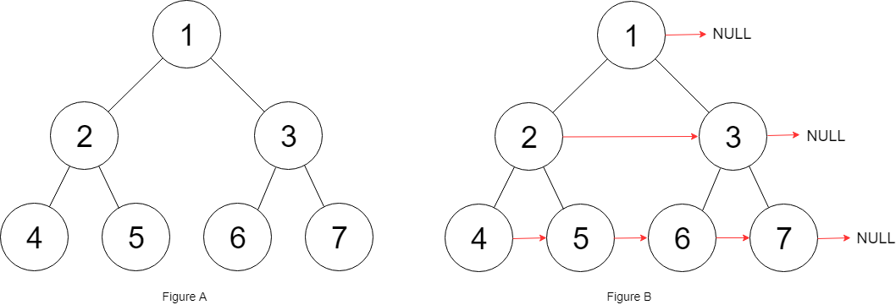

# Trees and Graphs

[LeetCode Graphs](https://leetcode.com/explore/learn/card/graph/)

[Binary Tree](https://leetcode.com/explore/learn/card/data-structure-tree/)

## Validate Binary Search Tree [152](https://leetcode.com/explore/interview/card/microsoft/31/trees-and-graphs/152/)

Given the root of a binary tree, determine if it is a valid binary search tree (BST).

A valid BST is defined as follows:

- The left subtree of a node contains only nodes with keys less than the node's key.
- The right subtree of a node contains only nodes with keys greater than the node's key.
- Both the left and right subtrees must also be binary search trees.

### Example 1:


```
Input: root = [2,1,3]
Output: true
```
### Example 2:


```
Input: root = [5,1,4,null,null,3,6]
Output: false
Explanation: The root node's value is 5 but its right child's value is 4.
```

### Constraints:

```
The number of nodes in the tree is in the range [1, 104].
-231 <= Node.val <= 231 - 1
```

```C#
/**
 * Definition for a binary tree node.
 * public class TreeNode {
 *     public int val;
 *     public TreeNode left;
 *     public TreeNode right;
 *     public TreeNode(int val=0, TreeNode left=null, TreeNode right=null) {
 *         this.val = val;
 *         this.left = left;
 *         this.right = right;
 *     }
 * }
 */
public class Solution {
    public bool IsValidBST(TreeNode root) {
        return Evaluate(root, long.MinValue, long.MaxValue);
    }

    private bool Evaluate(TreeNode node, long min, long max)
    {
        if (node == null)
        {
            return true;
        }

        return (
            node.val > min &&
            node.val < max &&
            Evaluate(node.left, min, node.val) &&
            Evaluate(node.right, node.val, max)
        );
    }
}
```

> Time complexity: O(N) since we visit each node exactly once.
> Space complexity: O(N) since we keep up to the entire tree.

[Solution](https://leetcode.com/problems/validate-binary-search-tree/editorial/)

## Binary Tree Inorder Traversal [153](https://leetcode.com/explore/interview/card/microsoft/31/trees-and-graphs/153/)

Given the root of a binary tree, return the inorder traversal of its nodes' values.

### Example1:


```
Input: root = [1,null,2,3]
Output: [1,3,2]
```

### Example 2:

```
Input: root = []
Output: []
```

### Example 3:

Input: root = [1]
Output: [1]


### Constraints:

```
The number of nodes in the tree is in the range [0, 100].
-100 <= Node.val <= 100
```

> Follow up: Recursive solution is trivial, could you do it iteratively?


```C#
/**
 * Definition for a binary tree node.
 * public class TreeNode {
 *     public int val;
 *     public TreeNode left;
 *     public TreeNode right;
 *     public TreeNode(int val=0, TreeNode left=null, TreeNode right=null) {
 *         this.val = val;
 *         this.left = left;
 *         this.right = right;
 *     }
 * }
 */
public class Solution {
    public IList<int> InorderTraversal(TreeNode root) {
        List<int> result = new List<int>();
        void InOrder(TreeNode node)
        {
            if(node!=null)
            {
                InOrder(node.left);
                result.Add(node.val);
                InOrder(node.right);
            }
        }
        InOrder(root);
        return result;
    }
}
```

## Binary Tree Level Order Traversal [164](https://leetcode.com/explore/interview/card/microsoft/31/trees-and-graphs/164/)

```C#
 /**
 * Definition for a binary tree node.
 * public class TreeNode {
 *     public int val;
 *     public TreeNode left;
 *     public TreeNode right;
 *     public TreeNode(int val=0, TreeNode left=null, TreeNode right=null) {
 *         this.val = val;
 *         this.left = left;
 *         this.right = right;
 *     }
 * }
 */
public class Solution {
    public IList<IList<int>> LevelOrder(TreeNode root)
    {             
        var result = new List<IList<int>>();           
        var que = new Queue<TreeNode>();

        if(root==null) return result;

        que.Enqueue(root);
        while (que.Count != 0)
        {
            int n = que.Count;
            var subList = new List<int>();
            for (int i = 0; i < n; i++)
            {
                if (que.Peek().left != null)
                    que.Enqueue(que.Peek().left);
                if (que.Peek().right != null)
                    que.Enqueue(que.Peek().right);
                subList.Add(que.Dequeue().val);
            }
            result.Add(subList);
        }
        return result;
    }
}
```

## Binary Tree Zigzag Level Order Traversal [197](https://leetcode.com/explore/interview/card/microsoft/31/trees-and-graphs/197/)

```C#
/**
 * Definition for a binary tree node.
 * public class TreeNode {
 *     public int val;
 *     public TreeNode left;
 *     public TreeNode right;
 *     public TreeNode(int val=0, TreeNode left=null, TreeNode right=null) {
 *         this.val = val;
 *         this.left = left;
 *         this.right = right;
 *     }
 * }
 */
public class Solution {
    public IList<IList<int>> ZigzagLevelOrder(TreeNode root) {
        var result = new List<IList<int>>();
        if (root == null) return result;

        var queue = new Queue<IEnumerable<TreeNode>>();
        queue.Enqueue(new []{root});
        var level = 0;

        while(queue.Any())
        {
            var nextLevel = new Stack<TreeNode>();
            var levelRes = new List<int>();
            result.Add(levelRes);
            var isEven = level++%2==0;
            foreach(var node in queue.Dequeue())
            {
                levelRes.Add(node.val);
                
                var first = isEven ? node.left : node.right;
                var second = isEven ? node.right : node.left;

                if (first != null) nextLevel.Push(first);
                if (second != null) nextLevel.Push(second);
            }
            if (nextLevel.Any())
            {
                queue.Enqueue(nextLevel);
            }
        }
        return result;
    }
}
```

## Populating Next Right Pointers in Each Node [192](https://leetcode.com/explore/interview/card/microsoft/31/trees-and-graphs/192/)

You are given a perfect binary tree where all leaves are on the same level, and every parent has two children. The binary tree has the following definition:
```
struct Node {
  int val;
  Node *left;
  Node *right;
  Node *next;
}
```
Populate each next pointer to point to its next right node. If there is no next right node, the next pointer should be set to NULL.

Initially, all next pointers are set to NULL.

### Example 1:



```
Input: root = [1,2,3,4,5,6,7]
Output: [1,#,2,3,#,4,5,6,7,#]
Explanation: Given the above perfect binary tree (Figure A), your function should populate each next pointer to point to its next right node, just like in Figure B. The serialized output is in level order as connected by the next pointers, with '#' signifying the end of each level.
```

### Example 2:

```
Input: root = []
Output: []
```

### Constraints:

```
The number of nodes in the tree is in the range [0, 212 - 1].
-1000 <= Node.val <= 1000
```

>Follow-up:
>
> You may only use constant extra space.
>
>The recursive approach is fine. You may assume implicit stack space does not count as extra space for this problem.

```C#
/*
// Definition for a Node.
public class Node {
    public int val;
    public Node left;
    public Node right;
    public Node next;

    public Node() {}

    public Node(int _val) {
        val = _val;
    }

    public Node(int _val, Node _left, Node _right, Node _next) {
        val = _val;
        left = _left;
        right = _right;
        next = _next;
    }
}
*/

public class Solution {
    public Node Connect(Node root) {
        if(root == null) return root;
        Queue<Node> que = new Queue<Node>();
        que.Enqueue(root);
        while(que.Count > 0)
        {
            int size = que.Count;
            for(int i=0; i < size; i++)
            {
                Node node = que.Dequeue();
                if(i < size - 1)
                {
                    node.next = que.Peek();
                }
                if(node.left != null)
                {
                    que.Enqueue(node.left);
                }
                   if(node.right != null)
                {
                    que.Enqueue(node.right);
                }
            }
        }
        return root;
    }
}
```

> O(N), O(N)

[Solution](https://leetcode.com/problems/populating-next-right-pointers-in-each-node/editorial/)


## Populating Next Right Pointers in Each Node II [163](https://leetcode.com/explore/interview/card/microsoft/31/trees-and-graphs/163/)

```C#
/*
// Definition for a Node.
public class Node {
    public int val;
    public Node left;
    public Node right;
    public Node next;

    public Node() {}

    public Node(int _val) {
        val = _val;
    }

    public Node(int _val, Node _left, Node _right, Node _next) {
        val = _val;
        left = _left;
        right = _right;
        next = _next;
    }
}
*/

public class Solution {
    public Node Connect(Node root) {
        if(root == null)
        {
            return root;   
        }
           
        var que = new Queue<Node>();
        que.Enqueue(root);

        while (que.Count > 0)
        {
            int n = que.Count;
        
            for (int i = 0; i < n; i++)
            {
                Node node = que.Dequeue();

                if(i<n-1)
                {
                    node.next = que.Peek();
                }

                if (node.left != null)
                {
                    que.Enqueue(node.left);
                }
                if (node.right != null)
                {
                    que.Enqueue(node.right);
                }
            }   
        }
        return root;
    }
}
```

## Lowest Common Ancestor of a Binary Search Tree [182](https://leetcode.com/explore/interview/card/microsoft/31/trees-and-graphs/182/)

```C#
/**
 * Definition for a binary tree node.
 * public class TreeNode {
 *     public int val;
 *     public TreeNode left;
 *     public TreeNode right;
 *     public TreeNode(int x) { val = x; }
 * }
 */

public class Solution {
    public TreeNode LowestCommonAncestor(TreeNode root, TreeNode p, TreeNode q) {
        int parentVal = root.val;
        int pVal = p.val;
        int qVal = q.val;

        if(pVal > parentVal && qVal > parentVal)
        {
            return LowestCommonAncestor(root.right, p, q);
        }
        else if(pVal < parentVal && qVal < parentVal)
        {
            return LowestCommonAncestor(root.left, p, q);
        }
        else
        {
            return root;
        }
    }
}
```

## Lowest Common Ancestor of a Binary Tree [181](https://leetcode.com/explore/interview/card/microsoft/31/trees-and-graphs/181/)

```C#
/**
 * Definition for a binary tree node.
 * public class TreeNode {
 *     public int val;
 *     public TreeNode left;
 *     public TreeNode right;
 *     public TreeNode(int x) { val = x; }
 * }
 */
public class Solution {
    TreeNode ans = null;

    bool recurseTree(TreeNode currentNode, TreeNode p, TreeNode q)
    {
        if(currentNode == null)
        {
            return false;
        }

        int left = recurseTree(currentNode.left, p, q) ? 1 : 0;
        int right = recurseTree(currentNode.right, p, q) ? 1 : 0;
        int mid = (currentNode == p || currentNode == q) ? 1 : 0;

        if(mid + left + right >= 2)
        {
            ans = currentNode;
        }
        return mid + left + right > 0;
    }

    public TreeNode LowestCommonAncestor(TreeNode root, TreeNode p, TreeNode q) {
        recurseTree(root, p, q);
        return ans;
    }
}
```

## Construct Binary Tree from Preorder and Inorder Traversal [196](https://leetcode.com/explore/interview/card/microsoft/31/trees-and-graphs/196/)

```C#
/**
 * Definition for a binary tree node.
 * public class TreeNode {
 *     public int val;
 *     public TreeNode left;
 *     public TreeNode right;
 *     public TreeNode(int val=0, TreeNode left=null, TreeNode right=null) {
 *         this.val = val;
 *         this.left = left;
 *         this.right = right;
 *     }
 * }
 */
public class Solution {
    int preorderIndex = 0;
    Dictionary<int, int> inorderIndexMap = new Dictionary<int, int>();

    public TreeNode ArrayToTree(int[] preorder, int left, int right)
    {
        if(left > right) return null;
        int rootValue = preorder[preorderIndex++];
        TreeNode root = new TreeNode(rootValue);
        root.left = ArrayToTree(preorder, left, inorderIndexMap[rootValue] - 1);
        root.right = ArrayToTree(preorder, inorderIndexMap[rootValue] + 1, right);
        return root;
    }

    public TreeNode BuildTree(int[] preorder, int[] inorder) {
        for(int i = 0; i < inorder.Length; i++)
        {
            inorderIndexMap.Add(inorder[i], i);
        }

        return ArrayToTree(preorder, 0, preorder.Length - 1);
    }
}
```

> O(N), O(N)

[Solution](https://leetcode.com/problems/construct-binary-tree-from-preorder-and-inorder-traversal/editorial/)

## Number of Islands [185](https://leetcode.com/explore/interview/card/microsoft/31/trees-and-graphs/185/)

```C#
public class Solution {
    public int NumIslands(char[][] grid) {
        if (grid == null || grid.Length == 0)
            return 0;

        int count = 0;
        int rows = grid.Length;
        int cols = grid[0].Length;

        // Iterate over each cell in the grid
        for (int i = 0; i < rows; i++)
        {
            for (int j = 0; j < cols; j++)
            {
                if (grid[i][j] == '1')
                {
                    // Found a land cell, increment count and perform DFS to mark adjacent land cells
                    count++;
                    DFS(grid, i, j, rows, cols);
                }
            }
        }
        return count;
    }

    // Depth First Search to mark adjacent land cells as visited
    void DFS(char[][] grid, int i, int j, int rows, int cols)
    {
        if (i < 0 || i >= rows || j < 0 || j >= cols || grid[i][j] == '0')
            return;

        // Mark current cell as visited
        grid[i][j] = '0';

        // Visit adjacent cells
        DFS(grid, i + 1, j, rows, cols); // down
        DFS(grid, i - 1, j, rows, cols); // up
        DFS(grid, i, j + 1, rows, cols); // right
        DFS(grid, i, j - 1, rows, cols); // left
    }
}
```

> O(MxN), O(MxN)

[Solution](https://leetcode.com/problems/number-of-islands/editorial/)

## Clone Graph [210](https://leetcode.com/explore/interview/card/microsoft/31/trees-and-graphs/210/)

```C#
/*
// Definition for a Node.
public class Node {
    public int val;
    public IList<Node> neighbors;

    public Node() {
        val = 0;
        neighbors = new List<Node>();
    }

    public Node(int _val) {
        val = _val;
        neighbors = new List<Node>();
    }

    public Node(int _val, List<Node> _neighbors) {
        val = _val;
        neighbors = _neighbors;
    }
}
*/

public class Solution {
    Dictionary<Node,Node> visited = new Dictionary<Node,Node>();
    public Node CloneGraph(Node node) {
        if (node == null) return node;

        if(visited.ContainsKey(node))
        {
            return visited[node];
        }

        var cloneNode = new Node(node.val, new List<Node>());
        visited.Add(node, cloneNode);

        foreach(Node neighbor in node.neighbors) {
            cloneNode.neighbors.Add(CloneGraph(neighbor));
        }
        return cloneNode;
    }
}
```

